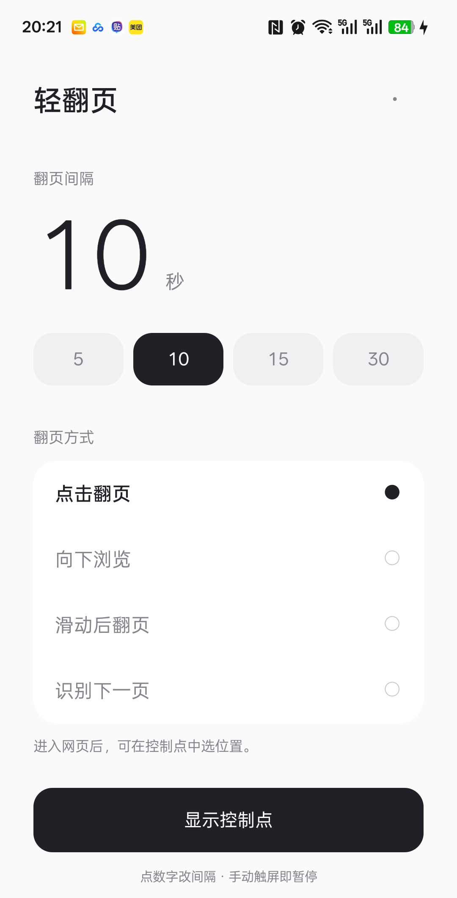

# PageTurner · 轻翻页

[中文](README.md) · **English** · [日本語](README.ja.md)

A minimal Android auto page turner

Read comics, image galleries or long web pages with timed taps and scrolls — touch the screen to pause

Oh, and those times when your hands are busy… you know

**[Download the APK](https://github.com/BsTso/page-turner-releases/releases/latest)** · [Report an issue](https://github.com/BsTso/page-turner-releases/issues) · [Build it yourself](BUILDING.md#build-on-windows)

## What it does

- Turns pages at a set interval, using next-page button detection or a chosen spot on the screen
- Scrolls down long pages, with an option to turn after reaching the bottom
- Provides a floating dot: tap to start or pause, hold for controls, drag to move
- Remembers tap positions and scroll distances for different foldable screen sizes
- Pauses after two turns with no detected page change, with an option to disable this check
- Completely free, with no account or ads
- Supports Chinese, English and Japanese, with an in-app language switch
- Handy for reading and those hands-busy moments

## How to use it

1. Download the APK and install it on your Android phone
2. Follow the setup guide to enable the PageTurner accessibility service — no separate overlay permission is needed
3. Choose an interval and reading mode, then tap **Show floating dot**
4. Open a reading page, hold the dot to choose a spot, then tap the dot to start

Touch or scroll the page yourself to pause, then tap the dot to resume

## Languages

The app follows your phone's language preferences on first launch, falling back to English if none are supported

Open settings at the top right and choose **Language** to select 简体中文, English, 日本語 or System default

One APK includes all three languages, with no regional downloads, IP lookup or location access

## Before you start

Requires Android 8.0 or later, with your reading page in the foreground

Page turning pauses when you switch apps, lock the screen, fold the phone or rotate it

Pages must expose readable accessibility information to detect the bottom or a next-page button; if the bottom cannot be detected, the app uses your chosen scroll count

Fixed-position taps cannot distinguish ads or page pop-ups, and touch-to-pause behavior may vary by phone

No screenshots or network access during reading, with a connection to GitHub only when you check for updates

## Help improve it

Found a problem? Open an issue with your phone model, Android version, browser or app, and what went wrong

Fixes, compatibility improvements and wording suggestions are welcome — run the build checks before submitting code

If you find it useful, a Star is welcome ⭐

## License

[MIT](LICENSE) · Copyright (c) 2026 JamieTso

Made by JamieTso, thanks for using it
